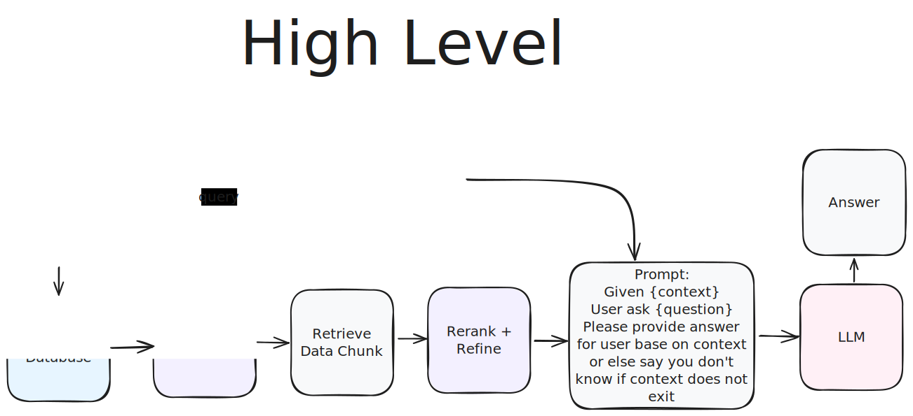
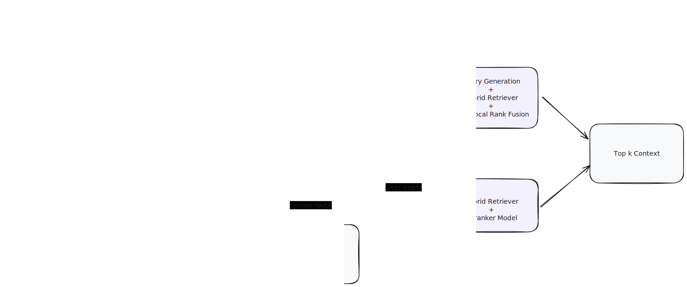

# 🤖 Chat with multiple PDFs locally


# ⭐️ Key Features

- Easy to run on `Local`
- Process multiple type of inputs (.pdf, .txt). 
- Process multiple files in succession.
- Chat with multiples languages (Vietnamese or English).
- Simple UI with `Gradio`.

# 💡 Idea





## 1. 💻 Setup in Local

### 1.1. Clone project

```bash
git clone https://github.com/leviethg/rag_02.git
cd rag_02/rag-chatbot
```

### 1.2 Install using Docker

```bash
docker compose up --build
```

### 1.3 Run

```bash
docker-compose up app chromadb
```

### 2. Go to: `http://localhost:7860/` after setup completed


